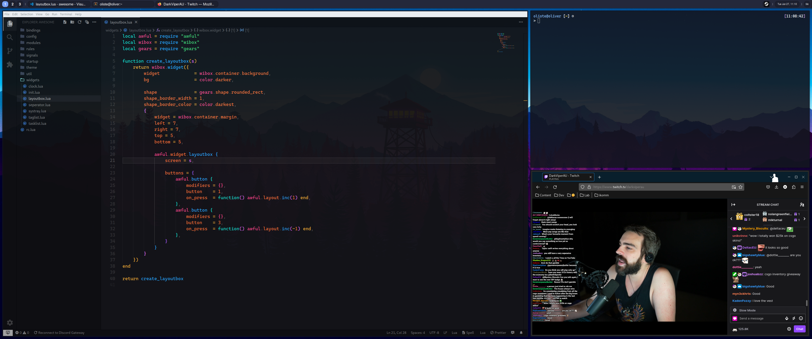

# NUB31's dotfiles

<div align="center">
    
</div>

## Installation

```bash
# Install updates
sudo apt update && sudo apt upgrade -y

# Install dependencies
sudo apt install -y xorg libxcb-xfixes0-dev git
sudo apt-get build-dep -y awesome

# Build awesome
git clone https://github.com/awesomewm/awesome
cd awesome
make package
sudo cp awesome.desktop /usr/share/xsessions/

# IMPORTANT: Replace {generated_deb_file} with the generated deb file printed in the console
sudo apt install {generated_deb_file}

cd ../
sudo rm -rf awesome

# Apply config
mkdir -p $HOME/.config/
cp -rT dotfiles $HOME

# Apply icon theme
sudo mkdir -p /usr/share/cursors/xorg-x11/.icons
sudo cp -rT $HOME/.icons /usr/share/cursors/xorg-x11/.icons

# Disable mouse acceleration
sudo bash -c "echo 'Section \"InputClass\" Identifier \"My Mouse\" Driver \"libinput\" MatchIsPointer \"yes\" Option \"AccelProfile\" \"flat\" EndSection' > /etc/X11/xorg.conf.d/50-mouse-acceleration.conf"

# Apply font
echo 'gtk-font-name="Cantarell 11"' >> $HOME/.config/.gtkrc-2.0
sudo bash -c "echo 'Section \"Files\" FontPath \"/usr/share/fonts/cantarell/\" EndSection' > /etc/X11/xorg.conf.d/10-fonts.conf"

# Set alacritty as default terminal when pressing open in terminal from nemo
gsettings set org.cinnamon.desktop.default-applications.terminal exec alacritty

# Install starship
curl -sS https://starship.rs/install.sh | sh
echo eval '"$(starship init bash)"' >> "$HOME/.bashrc"

# Install software referenced in the awesome config
sudo apt install -my feh picom rofi firefox nemo imagemagick gpick ffmpeg i3lock pavucontrol nemo
sudo add-apt-repository ppa:aslatter/ppa -y
sudo apt install alacritty

# Install JetBrainsMono Nerd Font
mkdir -p $HOME/.local/share/fonts
cd $HOME/.local/share/fonts
wget https://github.com/ryanoasis/nerd-fonts/releases/download/v3.0.2/JetBrainsMono.zip
unzip JetBrainsMono.zip
rm JetBrainsMono.zip
```
